# 架构文档

## 目标

验证一套把海外公共镜像（Docker Hub、registry.k8s.io、ECR Public、Quay、GHCR、GCR）自动同步到 AWS 中国区 ECR 的平台：解决中国区网络无法稳定访问海外公共镜像站的问题，同时支持"固定 tag"（生产组件锁版本）和"每周自动追版"（基础镜像持续跟进社区最新版）两种维护模式。

## 组件

- **触发层**：GitHub Actions（PR merge 到 `regsync.yml`/`required-images-weekly.txt`、每周一 UTC 18:00 定时、手动 workflow dispatch）
- **校验**：`validate` workflow 跑 `scripts/tools.py validate` / `lint-weekly`，PR 阶段拦截格式错误和误用 `docker.io/library` 源的条目
- **准备与拆分**：`prepare` job 合并 `regsync.yml` 与每周配置，按 registry（ecrpublic/dockerhub/quay/ghcr/gcr/registryk8sio）拆分为子配置并上传 S3
- **同步执行**：Tokyo（日本区）CodeBuild，按 registry 并行执行 `regsync`，直接从海外公共 registry 拉取镜像并推送到中国区 ECR（`fail-fast: false`，互不影响）
- **每周追版**：`build-weekly-config` job 查询各 registry API 获取最新稳定 tag（每镜像最多保留 2 个 minor 版本，跳过 alpha/beta/rc 等 deny tag），digest 未变的镜像跳过
- **目标仓库**：中国区（`cn-northwest-1`）ECR Private Registry，`AWS::ECR::RepositoryCreationTemplate` 按 prefix 自动建仓，内置 lifecycle policy（默认每仓库最多 50 个镜像）
- **清理**：Lambda（cleanup）定期删除超过阈值天数未拉取的镜像，默认 dry run，报告写 S3 并通过 SNS 通知
- **消费便利化**：Lambda + API Gateway 实现 Kubernetes MutatingWebhook，自动改写 Pod 中的 image 路径指向中国区 ECR
- **产物目录**：`catalog/` 下的 `mirrored-images.{txt,json,csv}`，每次同步后自动更新，供下游查询已同步镜像清单

## 架构图

```mermaid
flowchart TB
  Maintainer["维护者\nPR: regsync.yml / required-images-weekly.txt"]

  subgraph Overseas["海外：GitHub Actions + Tokyo CodeBuild"]
    Validate["validate workflow\ntools.py validate / lint-weekly"]
    Prepare["prepare job\n合并配置 + 按 registry 拆分 → S3"]
    subgraph CBFleet["CodeBuild（按 registry 并行）"]
      CBEcrPublic["CodeBuild: ecrpublic"]
      CBDockerHub["CodeBuild: dockerhub"]
      CBQuay["CodeBuild: quay"]
      CBGhcr["CodeBuild: ghcr"]
      CBOthers["CodeBuild: gcr / registryk8sio / ..."]
    end
    Sources["源 Registry\nDocker Hub / registry.k8s.io\nECR Public / Quay / GHCR / GCR"]
    Weekly["build-weekly-config\n查询最新稳定 tag"]
    Catalog["catalog job\n更新 catalog/*"]
  end

  subgraph China["中国区 cn-northwest-1"]
    ECR["ECR Private Registry\ndockerhub/ registryk8sio/ ecrpublic/\nquay/ ghcr/ gcr/ ..."]
    CleanupLambda["Lambda: cleanup\n月度清理过期镜像"]
    WebhookLambda["API Gateway + Lambda\nK8s MutatingWebhook"]
    S3Report["S3\n子配置 + 清理报告"]
    SNS["SNS\n清理通知"]
  end

  Consumers["消费方\nDocker / Kubernetes / ECS-Fargate / Helm / Kustomize"]

  Maintainer -->|PR merge / 定时 / 手动 dispatch| Validate
  Validate --> Prepare
  Weekly --> Prepare
  Prepare --> CBFleet
  Prepare --> S3Report
  Sources -->|pull| CBFleet
  CBFleet -->|push（海外直连中国区 ECR）| ECR
  CBFleet --> Catalog
  ECR --> CleanupLambda
  CleanupLambda --> S3Report
  CleanupLambda --> SNS
  ECR --> WebhookLambda
  WebhookLambda -->|改写 Pod image 路径| Consumers
  ECR -->|docker pull| Consumers
```

同步分两条独立触发路径但共享同一条执行管道：维护者提 PR 编辑 `regsync.yml`（固定 tag）或 `required-images-weekly.txt`（只写镜像名），`validate` workflow 先做格式与来源规则校验。PR merge、每周定时或手动触发后，`prepare` job 合并固定配置与最新版本配置，按 registry 拆分上传 S3，再由 Tokyo CodeBuild 并行拉取源镜像并直接推送到中国区 ECR——之所以在海外执行，是因为中国区机器无法稳定访问 Docker Hub/GHCR/GCR，中国区只承载 ECR 存储、清理、通知和 Webhook。

推送完成后 `catalog` job 更新镜像清单；ECR 侧另有 cleanup Lambda 按月清理超期未拉取镜像，以及 Kubernetes MutatingWebhook 自动把 Pod 中的公共镜像地址改写为中国区 ECR 路径，使下游用户无感知切换。

## 关键设计决策

- **为什么同步在海外执行**：中国区机器无法稳定访问 Docker Hub、GHCR、GCR 等海外 registry；Tokyo CodeBuild 同时具备海外访问能力和到中国区 ECR 的写入路径，是唯一可行的执行点。中国区只承载 ECR、清理、通知和 Webhook，不参与拉取。
- **为什么按 registry 拆分并行**：不同 registry 的限速和认证策略差异大（Docker Hub 200 pulls/6h、GHCR 需 PAT），串行执行一个 batch 超时会拖累全部；按 registry 拆分后各 batch 独立 CodeBuild，`fail-fast: false` 保证互不影响。
- **为什么 library 镜像优先用 ECR Public**：`public.ecr.aws/docker/library/*` 是 Docker Hub 官方库镜像的无限速镜像，内容与 `docker.io/library/*` 完全一致，写入 ECR 的路径也相同（`dockerhub/library/`），下游透明；`required-images-weekly.txt` 中强制使用该源，`lint-weekly` 在 PR 阶段拦截误用 `docker.io/library` 的条目。
- **ECR 如何防止 tag 无限积累**：ECR Repository Creation Template 内置 lifecycle policy，每个仓库默认最多保留 50 个镜像；cleanup Lambda 做第二层清理，删除超过阈值天数未拉取的镜像（默认 dry run）。

## 两条同步流程对比

| | 流程一：固定 tag | 流程二：每周自动追版 |
|---|---|---|
| 配置文件 | `regsync.yml` | `required-images-weekly.txt` |
| tag 管理 | 手动指定 | 自动查询最新稳定版 |
| 触发方式 | PR merge（路径匹配） | 每周 cron + 手动 dispatch |
| 适用场景 | 需要固定版本的生产组件 | 跟进社区最新版本的基础镜像 |
| Docker Hub library 来源 | 推荐改用 ECR Public | 强制使用 ECR Public（`lint-weekly` 拦截） |

两条流程的输出都写入同一个中国区 ECR，路径格式相同，下游 Webhook 和用户无感知。

## Registry 映射

| 源 registry | ECR 目标前缀 |
|---|---|
| `public.ecr.aws/docker/library/*` | `dockerhub/library/`（推荐，无 rate limit）|
| `docker.io/library/*` | `dockerhub/library/`（同路径，受限速，不推荐）|
| `docker.io/<org>/*` | `dockerhub/<org>/` |
| `public.ecr.aws/*` | `ecrpublic/` |
| `registry.k8s.io/*` | `registryk8sio/` |
| `gcr.io/*` | `gcr/` |
| `quay.io/*` | `quay/` |
| `ghcr.io/*` | `ghcr/` |
| `docker.elastic.co/*` | `elastic/` |
| Global ECR（`602401143452.*`） | `amazonecr/` |

更详细的操作步骤、AWS 资源清单和维护手册见 [background.md](background.md)、[usage.md](usage.md)、[operations.md](operations.md)、[migration.md](migration.md)。
